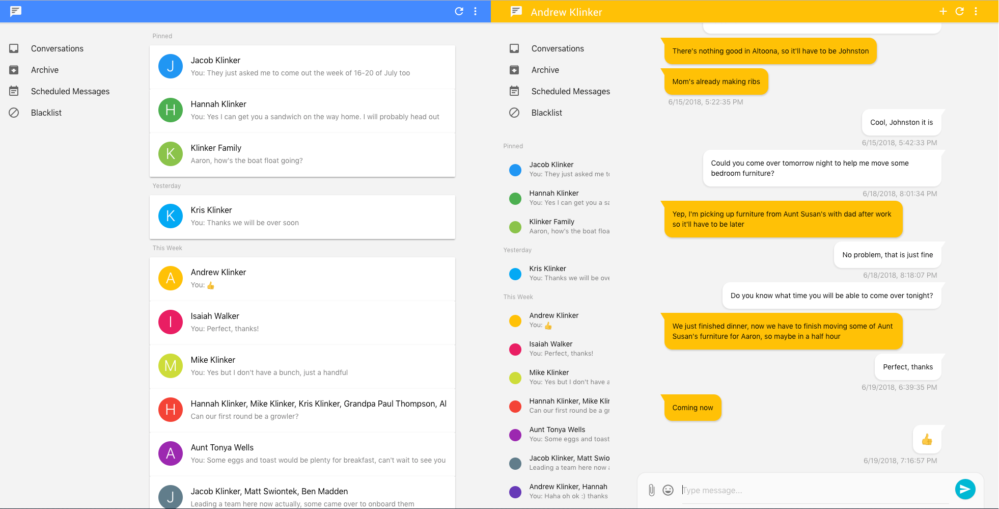

# Pulse SMS - Vue.js Web App



The Pulse community is pretty great. This web app started out as a [third party, alternative client](https://github.com/Serubin/PulseClient), to the official Pulse SMS web app. It is built on [Vue.js](https://vuejs.org/). Big thanks to [Solomon Rubin](https://github.com/Serubin) for creating an awesome base.

This version of the web app will be taking over as the official version, in the coming weeks/months. As an open-source client, anyone is free to contribute and help improve the Pulse experience. This web app has improved performance/load times, a cleaner architecture, and new features. It will be much easier to work with and improve, than the legacy web app.

Before you will be able to use this, you should create a Pulse account from the [Android app](https://messenger.klinkerapps.com/overview/signup.html). To use this web app, you have two options:

* Visit the hosted version of this web app, by opening https://pulsesms.app
* Build and run the web app locally, or deploy it to your own hosting location, using the build steps below.

## Build Setup

Getting up and running is very easy. You will need `npm` installed:

```bash
// install the dependencies
npm install

// start the server at localhost:8081
npm start
```

The `npm start` command should automatically open your web browser to a local version of the app. The local version of the web app will still use the same backend endpoints as the hosted version, so no additional configuration is required.

If you want to build the app for a production environment, that you could deploy:

```bash
# build for production with minification
npm run build

# build for production and view the bundle analyzer report
npm run build --report
```

## Contributing

Please fork this repository and contribute back using [pull requests](https://github.com/klinker-apps/messenger-web/pulls). Features can be requested using [issues](https://github.com/klinker-apps/messenger-issues/issues) on the Pulse SMS issue tracker/roadmap, rather than on the issues for this repo. I know there are some issues on this repo, right now. They will be migrated (or finished), as the app moves in to the production state.

Any code, comments, and critiques are appreciated.
